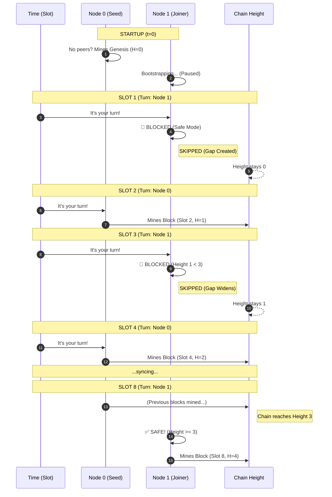

# DOLI Devnet Guide

Official guide for DOLI Devnet - the high-speed local development environment.

---

## 1. Overview

Devnet is designed for rapid iteration and local testing. Unlike Mainnet/Testnet which are persistent public networks, Devnet is usually ephemeral and runs locally or in a private cluster.

| Feature | Devnet | Mainnet/Testnet | Reason |
|---------|--------|-----------------|--------|
| **Slot Duration** | **1 second** | 10 seconds | Rapid feedback loop |
| **Genesis** | **Dynamic** | Fixed | Starts when *you* start |
| **VDF** | **Simulated** | Real Hardware | Instant blocks (no CPU burn) |
| **Bootstrapping** | **Sync-Before-Produce** | Hardcoded Seeds | Prevents split-brain genesis |

---

## 2. Bootstrap Mode (Sync-Before-Produce)

**This is the most critical difference in Devnet behavior.**

On Mainnet, the genesis block is hardcoded. On Devnet, the **first node to start creates the genesis block**. This creates a risk: if two nodes start at the same time without seeing each other, they might both create *different* genesis blocks, creating two incompatible networks ("split-brain").

To prevent this, Devnet nodes use **Sync-Before-Produce** logic:

1.  **Startup**: Node starts and enters "Bootstrap Mode".
2.  **Discovery**: It waits (default 5s) to find any peers.
3.  **Decision**:
    *   **If Peers Found**: It **pauses production** and syncs from them. It will *never* mine genesis.
    *   **If No Peers**: It assumes it is the first node ("Seed") and **mines the genesis block**.

### Implications for Developers

*   **"Stuck" at Height 0**: If you start a node with `--bootstrap` pointing to a peer that is offline, your node will *wait indefinitely* effectively. It won't mine genesis because you told it a peer *should* exist.
*   **Race Conditions**: If you script 5 nodes to start instantly in parallel, they might miss each other during the 1-2s discovery window. **Always start the seed node first**, wait 2 seconds, then start the rest.

---

## 3. Running a Local Devnet

### Option A: Automated (Recommended)

The CLI has a built-in devnet manager that handles ports, wallets, and configuration for you.

```bash
# 1. Initialize 5 nodes
doli-node devnet init --nodes 5

# 2. Start the cluster
doli-node devnet start

# 3. View status (PIDs, ports, heights)
doli-node devnet status

# 4. Stop
doli-node devnet stop

# 5. Clean up (wipes data)
doli-node devnet clean
```

### Option B: Manual (Advanced)

To run nodes manually (e.g., in separate terminals):

**Node 1 (The Seed)**
```bash
./doli-node --network devnet run \
    --data-dir ~/.doli/devnet-1 \
    --p2p-port 50301 --rpc-port 28541 \
    --producer --producer-key producer_1.json
```

**Node 2 (The Peer)**
```bash
# Must wait for Node 1 to be ready!
./doli-node --network devnet run \
    --data-dir ~/.doli/devnet-2 \
    --p2p-port 50302 --rpc-port 28542 \
    --producer --producer-key producer_2.json \
    --bootstrap /ip4/127.0.0.1/tcp/50301  # Connect to Node 1
```

---

## 4. Configuration Overrides

Devnet parameters are highly configurable via the `.env` file in your data directory (e.g., `~/.doli/devnet/.env`).

| Variable | Default (Devnet) | Description |
|----------|------------------|-------------|
| `DOLI_SLOT_DURATION` | `1` | Seconds per slot |
| `DOLI_VDF_ITERATIONS` | `1` | Block VDF iterations (1 = instant) |
| `DOLI_HEARTBEAT_VDF_ITERATIONS` | `10000000` | Keep high to test tpop load |
| `DOLI_UNBONDING_PERIOD` | `60480` | Reduce to `60` for fast exit testing |
| `DOLI_BLOCKS_PER_REWARD_EPOCH` | `360` | Reduce to `10` to test rewards often |

**Example Fast-Test Config:**
```bash
# ~/.doli/devnet/.env
DOLI_SLOT_DURATION=1
DOLI_UNBONDING_PERIOD=10    # 10 second exit
DOLI_COINBASE_MATURITY=5    # Spend rewards in 5 seconds
DOLI_VETO_PERIOD_SECS=60    # 1 minute upgrades
```

---

## 5. Troubleshooting

**"My devnet node isn't producing blocks!"**

1.  **Check Peers**: Run `curl -X POST http://localhost:28545 -d '{"jsonrpc":"2.0","method":"getNetworkInfo","params":[],"id":1}'`
    *   If `peerCount` is 0 and height is 0, you might be in the "Choice" phase of Bootstrap Mode.
2.  **Check Logs**:
    *   `"Waiting for peers..."` -> It's looking for sync targets.
    *   `"No peers found, assuming authority..."` -> It decided to mine genesis.
    *   `"Syncing..."` -> It found a peer and is downloading.

**"Why is Height < Slot? (e.g. Height 4 at Slot 8)"**

This "Gap" is the normal cost of safety. It happens because joining nodes **deliberately skip their turns** until they are sure they are on the right chain.

#### The "Gap" Visualization



#### What happened here?
1.  **Slot 1**: Assigned to Node 1, but Node 1 was in "Safe Mode". **Result:** Empty slot.
2.  **Slot 3**: Assigned to Node 1, but chain was too short to trust (Height 1). **Result:** Empty slot.
3.  **Slot 8**: Chain is stable (Height 3+). Node 1 finally joins in.

**Result:** We reached **Slot 8**, but only have **4 Blocks** (Height 4). The missing blocks are the "safety tax" we pay to ensure Node 1 didn't accidentally fork the network at the start.

---

## 6. Adding New Producers to Running Devnet

To add a new producer to an existing devnet, you must complete **all 4 steps**:

### Step 1: Create New Wallet

```bash
doli --wallet ~/.doli/devnet/keys/producer_NEW.json wallet new
```

### Step 2: Fund the Wallet

From an existing producer with mature DOLI:

```bash
# Get new wallet's pubkey hash
NEW_ADDR=$(doli --wallet ~/.doli/devnet/keys/producer_NEW.json wallet address | grep -o '[a-f0-9]\{64\}')

# Send from funded wallet (need 1+ DOLI for devnet bond)
doli --wallet ~/.doli/devnet/keys/producer_0.json \
    --rpc http://127.0.0.1:28545 \
    send $NEW_ADDR 10
```

### Step 3: Register as Producer

```bash
doli --wallet ~/.doli/devnet/keys/producer_NEW.json \
    --rpc http://127.0.0.1:28545 \
    producer register
```

### Step 4: Start Node with New Key (CRITICAL)

```bash
doli-node run --network devnet \
    --producer \
    --producer-key ~/.doli/devnet/keys/producer_NEW.json \
    --p2p-port 50309 \
    --rpc-port 28551 \
    --metrics-port 9096 \
    --bootstrap /ip4/127.0.0.1/tcp/50303 \
    --chainspec ~/.doli/devnet/chainspec.json \
    --yes
```

**Each new producer needs unique ports** (p2p, rpc, metrics).

### Common Mistake

| What you did | Result |
|--------------|--------|
| Steps 1-3 only | Producer registered but **no blocks produced** |
| Steps 1-4 | Producer registered **and producing blocks** |

Registration puts the public key on the blockchain. The node with `--producer-key` uses the private key to sign blocks. Without step 4, there's no process to produce blocks when that producer is selected.

### Verification

```bash
# Check producer is in active set
doli --rpc http://127.0.0.1:28545 producer list

# Watch new node's logs for production
grep "Producing block" ~/.doli/devnet/logs/node_NEW.log

# Verify balance increasing (block rewards)
doli --wallet ~/.doli/devnet/keys/producer_NEW.json \
    --rpc http://127.0.0.1:28545 \
    wallet balance
```
